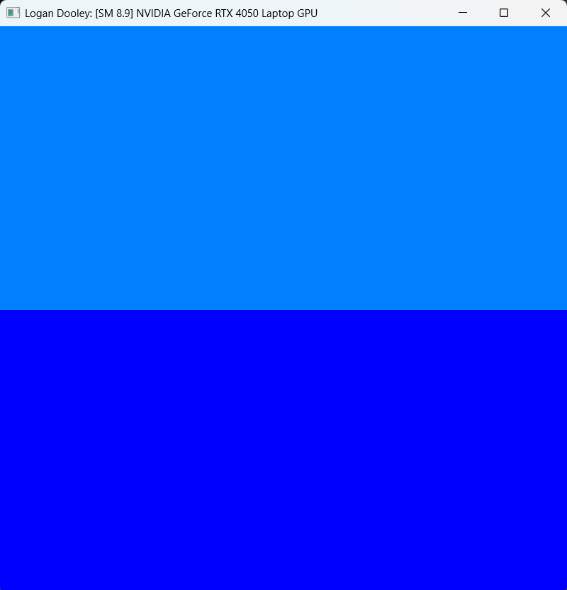
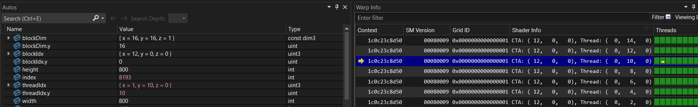
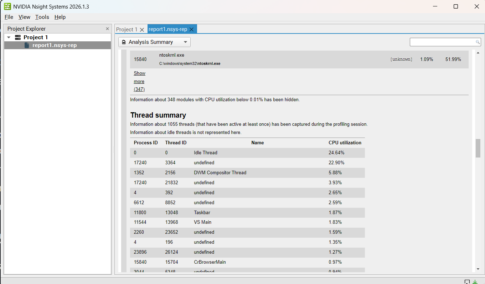
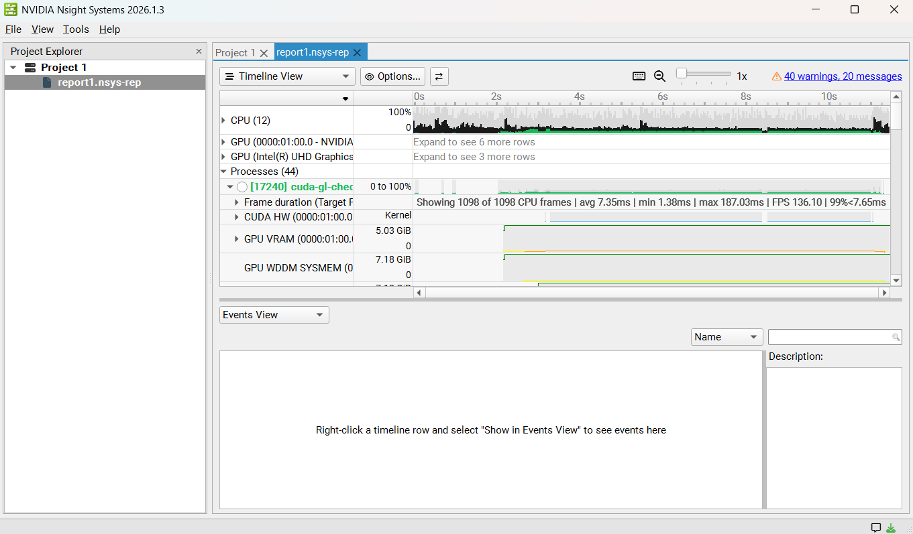
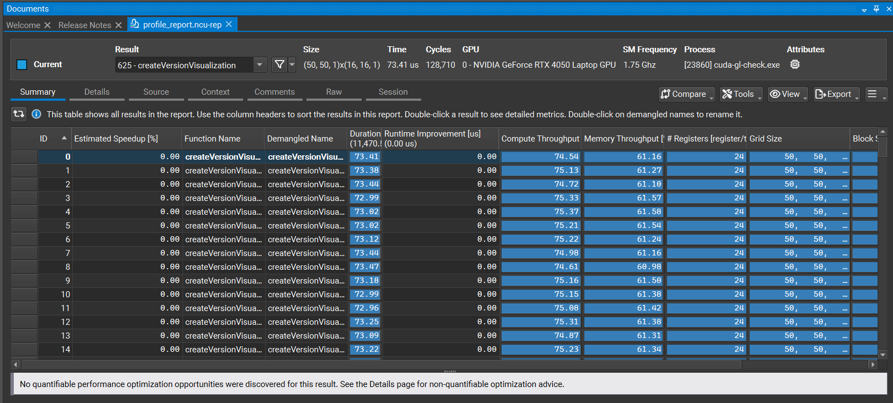
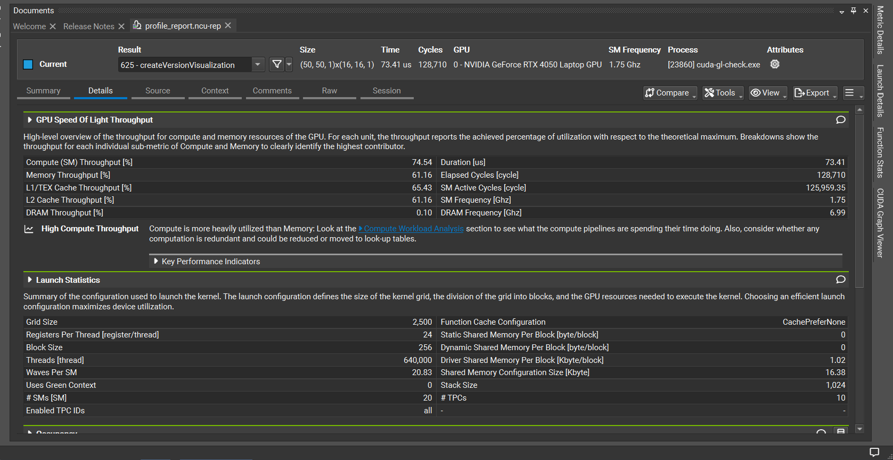
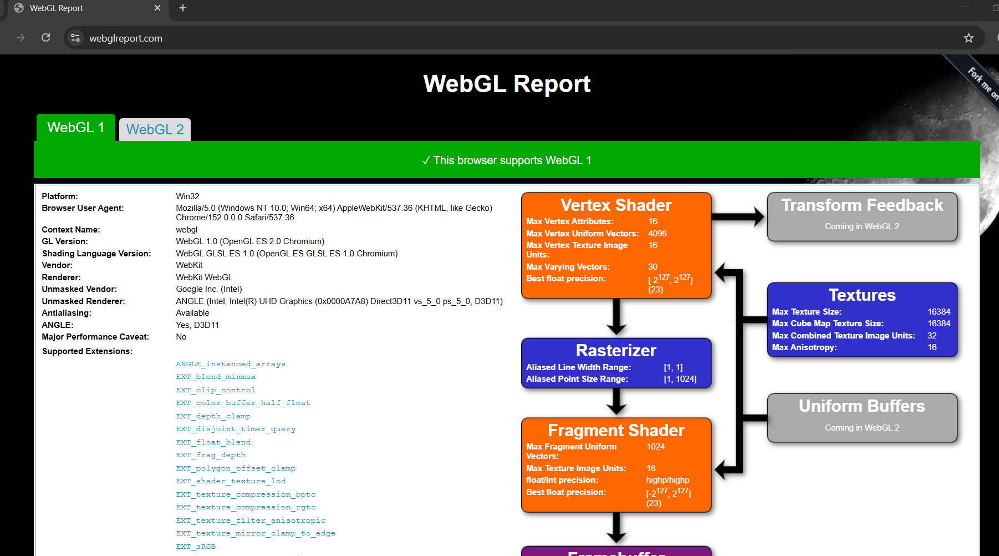
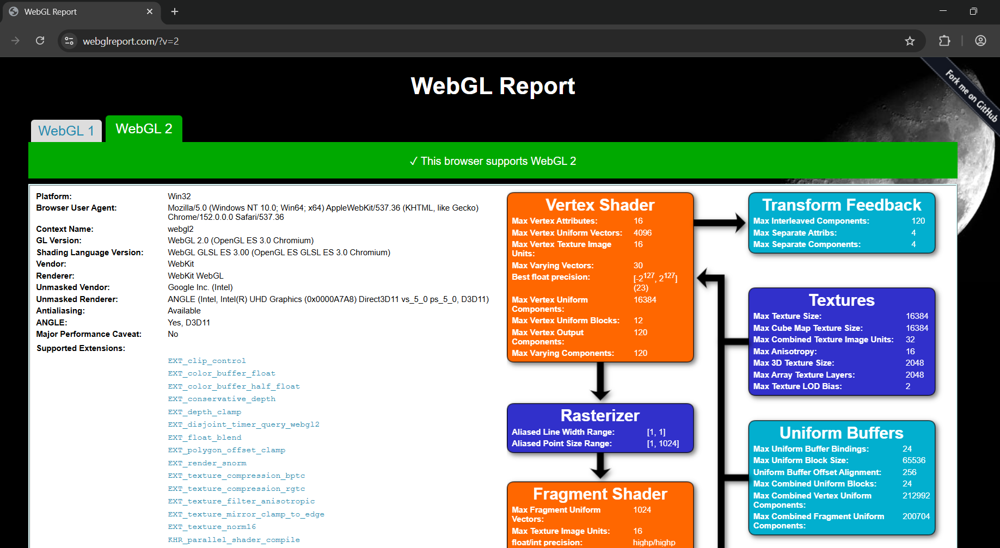
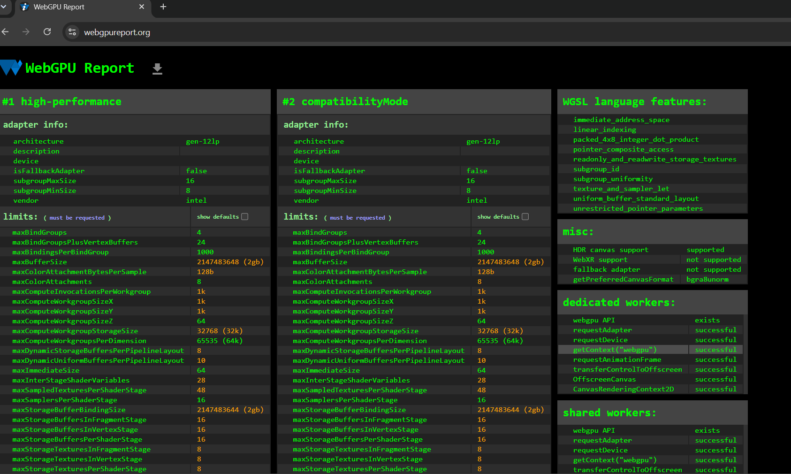

Project 0 Getting Started
====================

**University of Pennsylvania, CIS 5650: GPU Programming and Architecture, Project 0**

* Logan Dooley
  * [LinkedIn](https://www.linkedin.com/in/logan-dooley-a205a619a/)
* Tested on: Windows 11, 13th Gen Intel(R) Core(TM) i5-13420H (2.10 GHz), 16GB RAM, RTX 4050 Laptop

### 2.1.2: Modifying the CUDA Project

Here I added my name to the title:

### 2.1.3: NSight Debugging
Here I found block (12, 0, 0) thread index (1, 10, 0):

### 2.1.4 NSight Systems
System Analysis:

System Timeline:

### 2.1.5 NSight Compute

Compute Summary:

Compute Details:

### 2.2 WebGL Support
WebGL 1 Support:

WebGL 2 Support:

### 2.3 WebGPU Support
WebGPU Support:
